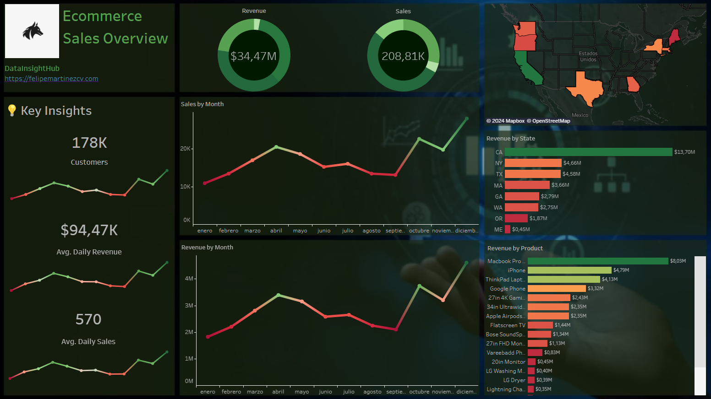

## Ecommerce Sales Electronic Products Dashboard - Data Preprocessing

### Overview
This project involves creating a dashboard in Tableau to visualize sales data of electronic products from an ecommerce platform. The data was obtained from Kaggle. Each month's data is stored in separate CSV files, such as Sales_January.csv, Sales_April.csv, and so on. To streamline data processing, a Python script within the load_data folder merges all monthly CSV files into one comprehensive dataset.

### Data Sources
- Kaggle: The dataset comprises sales data for electronic products from an ecommerce platform.
- Monthly CSV Files: Data is organized into separate CSV files for each month of the year.

### Folder Structure
* [data/](/data/): This directory contains the both preprocessed and unpreprocessed data.
* [Cleaning.ipynb](/src/Cleaning.ipynb): Jupyter notebook for data cleaning tasks.
* [Analysis.ipynb](/src/Analysis.ipynb): Jupyter notebook for exploratory data analysis.
* [dataloading.py](/src/load_data/dataloading.py): Python script to merge all monthly CSV files into one dataset.

### Data Preprocessing Steps
* Merging Monthly Data:
Utilize merge_data.py script to combine all monthly CSV files into a single dataset.
* Data Cleaning:
Handle missing values, inconsistencies, and outliers.
Standardize column names and formats for consistency.
Convert data types as necessary (e.g., date columns to datetime objects).
Remove duplicates if present.
* Feature Engineering:
Create new features that might provide valuable insights (e.g., total sales, average sales per day, etc.).
* Exporting Cleaned Data:
Save the cleaned dataset for further analysis and visualization.
